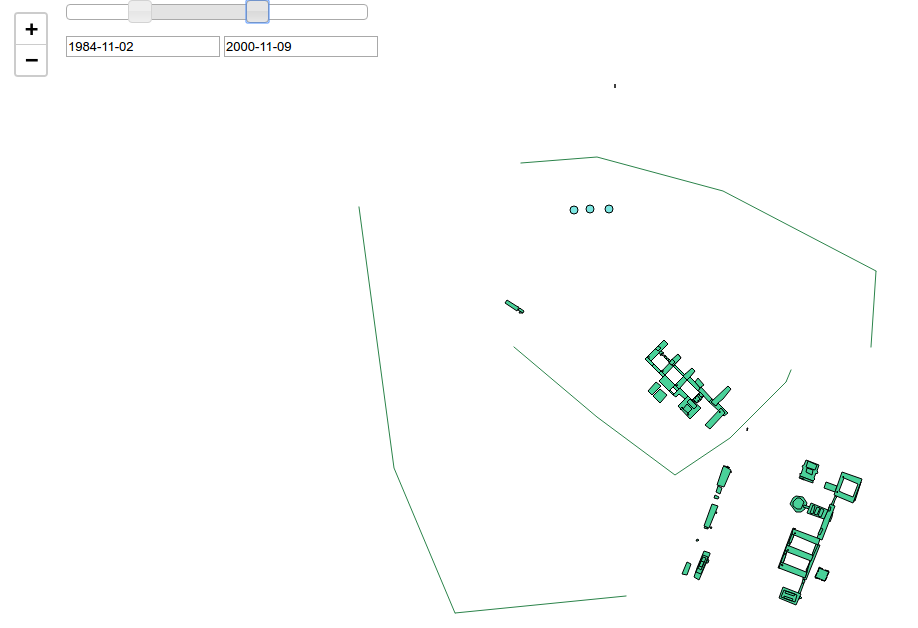

# qgis2web_time_extension
Time extension for qgis2web plugin

To activate extension you have to copy ui_timedialog.py to plugin
and add two lines of code to ui_maindialog.py

A. in header 

from ui_timedialog import Ui_TimeDialog #time

B. in setupUi place after 

self.tabWidget.addTab(self.tab_2, _fromUtf8(""))

this line

uitime = Ui_TimeDialog(self.tabWidget, MainDialog) #time

This will place the Time Tab at the end of the list of tabs. 
If you want to place it after tab Export than place the code 
after self.tabWidget.addTab(self.tab, _fromUtf8("")).

